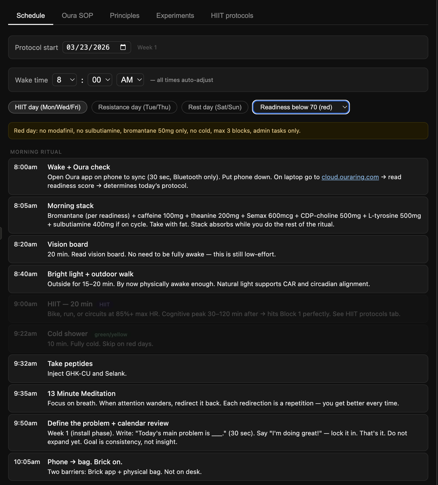
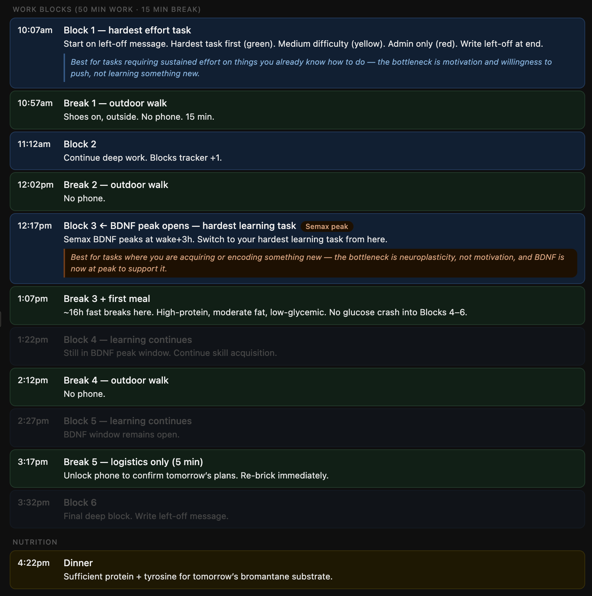

# Daily Schedule for Different Energy Levels

A single-file HTML app that generates a personalized daily schedule based on three inputs:

- **Day type** -- HIIT (Mon/Wed/Fri), Resistance (Tue/Thu), or Rest (Sat/Sun)
- **Readiness score** -- Green (85-100), Yellow (70-84), or Red (below 70) from Oura ring
- **Wake time** -- all event times auto-adjust

On low-energy days, high-intensity blocks are dimmed and the schedule shifts to recovery mode. On high-energy days, the full protocol runs with 6 work blocks, HIIT, and cold exposure.

Open `main.html` in any browser. No dependencies, no build step.

## Screenshots

